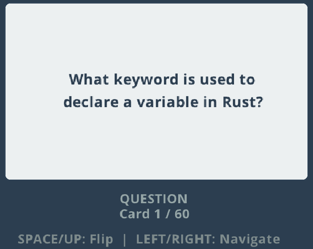
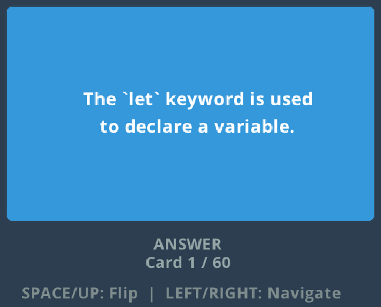

# Flashcard Game

A simple, interactive flashcard application built with Rust and Raylib. Study your flashcards with a clean, modern interface that supports CSV import.

## Features

- 📚 Load flashcards from CSV files
- 🔄 Flip cards to reveal answers
- ⬅️➡️ Navigate between cards easily
- 🎨 Clean, modern UI with smooth animations
- 🔤 Custom font support for better readability
- 💾 Robust CSV parsing (handles commas in text, quoted fields)

## Screenshots




## Installation

### Prerequisites

- Rust (1.91.1 or later)
- Cargo (comes with Rust)

### Building from Source

1. Clone this repository:
```bash
git clone https://github.com/paulbible/flashcards-with-raylib.git
cd flashcards-with-raylib
```

2. Build the project:
```bash
cargo build --release
```

3. Run the application:
```bash
cargo run --release
```

## Usage

### Creating Your Flashcard Deck

1. Create a file named `cards.csv` in the same directory as the executable
2. Format each line as: `question, answer` (I used NotebookLM's flashcard feature)
3. You can use commas within fields by wrapping them in quotes

**Example `cards.csv`:**
```csv
What is the capital of France?, Paris
What are the primary colors?, "Red, blue, and yellow"
Who wrote "Romeo and Juliet"?, "William Shakespeare"
What is 2 + 2?, 4
"What's the tallest mountain?", "Mount Everest, at 8,849 meters"
```

### Controls

| Key | Action |
|-----|--------|
| **SPACE** or **↑** | Flip the current card |
| **→** | Next card |
| **←** | Previous card |
| **ESC** | Exit application |

### Custom Font (Optional)

The open source font Open Sans is provided for this application. Please see the Open Font License document under OFL.txt

For better readability, you can add a custom font:

1. Download a TTF font file (recommendations below)
2. Rename it to `font.ttf`
3. Place it in the same directory as the executable

**Recommended Fonts:**
- [Roboto](https://fonts.google.com/specimen/Roboto) - Clean and modern
- [Open Sans](https://fonts.google.com/specimen/Open+Sans) - Highly readable
- [Inter](https://fonts.google.com/specimen/Inter) - Designed for screens
- [Source Sans Pro](https://fonts.google.com/specimen/Source+Sans+Pro) - Excellent for UI

The application will automatically use the custom font if available, or fall back to the default font.

## Configuration

### Cargo.toml

```toml
[package]
name = "flashcards-with-raylib"
version = "0.1.0"
edition = "2024"

[dependencies]
rand = "0.9.2"
raylib = "5.5.1"
```

## CSV Format Specification

The CSV parser supports:
- ✅ Standard comma-separated values
- ✅ Quoted fields containing commas
- ✅ Escaped quotes (`""`) within quoted fields
- ✅ Automatic whitespace trimming
- ✅ Empty line skipping

**Rules:**
- First column: Question text
- Second column: Answer text
- Additional columns are ignored
- Empty questions or answers are skipped

## Troubleshooting

### "Error loading cards.csv"
- Make sure `cards.csv` exists in the same directory as the executable
- Check that the file is readable and properly formatted

### "cards.csv is empty or contains no valid flashcards"
- Ensure your CSV has at least one valid row
- Check that both question and answer columns have content

### Font issues
- Custom fonts are optional; the app will work with the default font
- Ensure your `font.ttf` file is a valid TrueType font
- The font file must be in the same directory as the executable

## Development

### Project Structure

```
flashcard-game/
├── src/
│   └── main.rs          # Main application code
├── Cargo.toml           # Project dependencies
├── cards.csv            # Your flashcard deck
├── font.ttf             # (Optional) Custom font
└── README.md            # This file
```

### Building for Release

```bash
cargo build --release
```

The compiled binary will be in `target/release/`

## Contributing

Contributions are welcome! Please feel free to submit a Pull Request.

## License

This project is licensed under the LGPL License - see the LICENSE file for details.

## Acknowledgments

- This app was facilitated with Claude Sonnet 4.5 by Anthropic. Prompt details provided in AI_prompt_doc.pdf
- Built with [Raylib](https://www.raylib.com/)
- Rust bindings: [raylib-rs](https://github.com/raylib-rs/raylib-rs)
- This app uses Open Sans font. Please see the Open Font License document under OFL.txt


## Contact

Paul Bible - paulbible@depauw.edu

Project Link: https://github.com/paulbible/flashcards-with-raylib